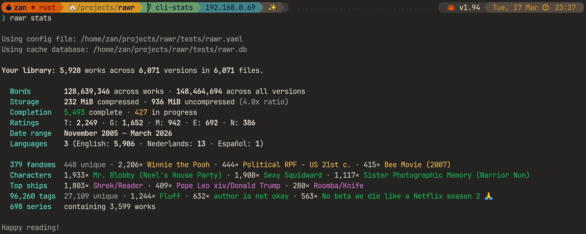

# 🦖 Rawr!

## What
Command-line tool for managing HTML downloads from [AO3](https://archiveofourown.org).
- **Organize downloaded works** into a central library, automatically renaming
  files and sorting into folders based on fandom/series/title, etc.
- **Track multiple versions** of the same work (chapter updates), because some
  authors decide to replace entire fics with messages about how they "found God"
  instead of orphaning.
- **Automatic compression** because 150 million words across 5k+ fics is
  approximately 200MB. In today's cloud storage terminology that's called "free".
- **Back up** to any S3-compatible cloud storage, because computers are fragile
  and what are you talking about "you shouldn't have been messing around with
  system files"?
- **Export to PDF/Ebook** with custom styling because GOOD LORD the PDF
  downloads that AO3 provides are _ugly_.

| Example Screenshot                           |
|----------------------------------------------|
|  |

## Why
You're having the most wonderful day and you settle down for the evening only to
find:

```
This has been deleted, sorry!
(Deleted work, last visited 05 Aug 2024)
```

**tl;dr:**
See a fic? Download it.
Got an email about a chapter update? Download again.

> For those using Gmail, auto-label emails from AO3 into new/update/complete
> using the [Google Apps script](./ao3-gmail-labeller.gs) (draft).

#### Why is the tool called `rawr`?
This is a tool to manage AO3 downloads, so I wanted to come up with a name that
was (a) related to the Archive, and (b) as ridiculous as the tags you depraved
lunatics come up with.

- I thought of calling it "Dead Dove", but `dd` is already a well-known CLI tool.
- As a **R**ust-based **Ar**chiver tool, `rar` unfortunately might cause
  flashbacks for people who never paid their WinRAR license.
- So I changed the pronunciation: imagine it being spoken by an Emo/Scene kid
  from the mid-2000's who was trying to unironically do an impression of a
  Tyrannosaurus Rex that had somehow magically gotten into Kawaii culture 65
  million years beyond its extinction.
- Thus `rawr` (or "**R**idiculously **A**ccumulating **W**orks to **R**ead" for
  long).

#### Why HTML only?
You only need to keep one format. `rawr` handles the rest:
- Squash it down real small, save space on that crusty ol' laptop of yours.
- Render to PDF or Ebook with custom themes/skins.

## Philosophy
> Authors have the right to delete their works. Readers have an interest in
> preserving what they've already read.

This tool is designed as an offline tool to manage HTML files that **you**
download _manually_. It **cannot** and **will not** download fics. By design.

AO3 is a resource run by a [non-profit](https://www.transformativeworks.org/),
and I built this tool specifically to **not** hammer their servers. Respect
[their terms of service](https://archiveofourown.org/tos), yo.

There's already enough tools focusing on _getting the fics_; `rawr` focuses on
what happens after you have it. Like your own stern librarian in an inflatable
dinosaur costume. (~~**Please,** for the love of everything fandom, somebody
make _Sexy Stern Dinosaur Librarian_ a real tag~~ 👩‍🏫 update: [thank you
ThoseDarnNuns](https://archiveofourown.org/works/81555506)!)

## Vision

| Command             | What it does                                                                  |
|---------------------|-------------------------------------------------------------------------------|
| `rawr init`         | Set up your library                                                           |
| `rawr import` (`i`) | Pull HTML files from your Downloads folder into your library                  |
| `rawr scan`         | Re-scan your library and extract/update metadata                              |
| `rawr organize`     | Sort and rename files by fandom/series/title (with compression)               |
| `rawr stats` (`s`)  | See your library at a glance                                                  |
| `rawr export pdf`   | Render works to PDF                                                           |
| `rawr export epub`  | Render works to ebook _(coming soon)_                                         |
| `rawr push`         | Sync to S3-compatible cloud storage _(coming soon)_                           |
| `rawr pull`         | Help! I dropped my laptop in the bath! Gimme my library back! _(coming soon)_ |

Use `--dry-run` on any command to preview what would happen without changing
anything. Useful if the idea of a CLI tool touching your carefully curated hoard
of smut makes you nervous.

## Quick Start

1. ~~Install~~ Build (sorry)
2. `rawr init` to create a configuration file
3. Download some fics from AO3 in HTML format
4. `rawr import` (defaults to searching for files in your Downloads folder)
5. Go outside for a walk, you probably haven't left the apartment in a few days.

# The Technical Stuff

## Installation
Pre-built releases will be available starting from the initial public release
(`v1`). For now, build from source. If you don't know how, ask the nerdiest
friend you've got.

```shell
cargo build --release
```

> If on Linux, use `cargo deploy` alias to enable super muscle builds 💪

## Roadmap
- [x] Library management (`scan`, `import`, `organize`)
- [x] Library statistics
- [x] Render works to PDF `export pdf` (basic)
- [ ] Render works to epub `export epub` (basic)
- [x] Config initialization `init` (basic)
- [ ] Syncing `push`/`pull` to S3
- [ ] Non-technical documentation
- [x] Render multiple works (interactive)
- [ ] A graphical point-and-click application for you Windows/Mac users (eventually)

### Good first contributions
- `rawr-compress`: add a new [compression format](crates/compress/src/lib.rs)
  gated behind a feature flag
- `rawr-extract`: extracting additional [AO3 metadata fields](crates/extract/src/extract/mod.rs)
- `rawr-storage`: adding a [new storage backend](crates/storage/src/backend/mod.rs)
  (e.g., Google Drive) gated behind a feature flag
- `rawr-cache`: adding [new queries](crates/cache/queries/) to the
  [repository](crates/cache/src/repo.rs)
- `rawr-render`: adding new [built-in themes](assets/styles/) (CSS stylesheets)
- `rawr-library`: new [template variables](crates/library/src/template.rs) for
  path generation
- `docs/`: yeah, we need those.

### License
[EU Public License `v1.2`](https://eupl.eu/1.2/en/).

> ~~This project will remain in beta for as long as AO3 does, which will be until
> the heat death of the universe.~~
>
> Oh, guess we're [stable now](https://www.transformativeworks.org/ao3-is-exiting-open-beta/)...
